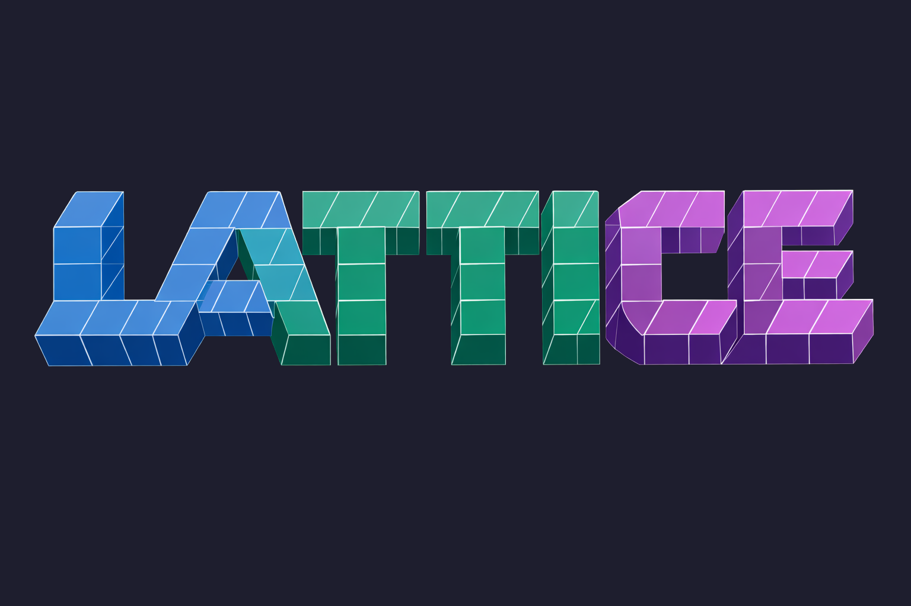

<p align="center">
  
</p>

# Lattice

GPU-accelerated wind tunnel that simulates fluid flow around 3D objects using Lattice Boltzmann Methods and OpenGL compute shaders. Written in C with a Next.js web frontend for remote rendering, plus a custom C++ ML framework for drag prediction.

The simulation runs a D3Q19 LBM grid on the GPU, pushes 50,000 particles through the velocity field, and computes drag/lift coefficients in real time. You can run it locally with a desktop window or trigger headless renders on a cloud GPU through the website.

## What's in here

```
simulation/   C simulation engine (LBM + OpenGL compute shaders)
website/      Next.js frontend that talks to a Modal GPU worker
ml/           C++ ML framework (autodiff, MLP, AdamW) + Python training tools
```

### Simulation (`simulation/`)

The core fluid solver. Particles are advected through a 3D velocity field computed by the LBM kernel, with collision detection against arbitrary OBJ meshes. Everything runs on the GPU via OpenGL 4.3 compute shaders.

- `src/` -- simulation loop, LBM solver, particle system, rendering
- `shaders/` -- compute shaders for LBM collision/streaming, particle updates, force computation, and streamline tracing
- `lib/` -- headers for fluid grid, particles, OpenGL helpers, ML inference
- `assets/` -- OBJ models (car, Ahmed bodies) and fonts
- `obj-file-loader/` -- lightweight Wavefront OBJ parser

Key solver features:
- D3Q19 lattice with BGK, regularized, and MRT collision operators
- Smagorinsky subgrid-scale turbulence model
- Bouzidi interpolated bounce-back for second-order wall accuracy
- Pressure/friction drag decomposition via equilibrium splitting
- Dimensionless time (t*, flow-throughs, CFL) reporting
- VTK ImageData export for ParaView post-processing

### Website (`website/`)

A Next.js app that lets you configure simulation parameters and kick off GPU renders via Modal. Styled with the Catppuccin Mocha palette.

Features:
- Configure wind speed, visualization mode, collision mode, and model selection
- Upload custom OBJ files for testing your own geometry
- Drag coefficient (Cd/Cl) readout with convergence chart and comparison table
- Live Cd/Cl streaming during renders -- watch coefficients converge in real time
- Batch parameter sweep with Cd vs wind speed curves
- ML surrogate predictions (in-browser, sub-millisecond)
- Strouhal number extraction from lift time series
- Shareable URLs via hash-encoded parameters
- CSV export with pressure/friction decomposition
- Demo mode when no GPU backend is configured

### ML (`ml/`)

A from-scratch C++ ML framework with reverse-mode autodiff, and Python tools for data generation and evaluation.

- `framework/` -- Tensor, AutoDiff, Linear layers, SwiGLU, AdamW optimizer, LTWS weight format
- `train.cpp` -- training driver with mini-batch SGD and z-score normalization
- `data_gen.py` -- parameter sweep on Modal for training data collection
- `evaluate.py` -- MAE/RMSE/R² metrics with matplotlib visualizations

## Building the simulation

### Dependencies

You need CMake, a C11 compiler, and OpenGL 4.3+ capable GPU drivers.

**Debian/Ubuntu:**
```bash
sudo apt-get install build-essential cmake pkg-config \
  libsdl2-dev libsdl2-ttf-dev libglew-dev mesa-common-dev libgl1-mesa-dev
```

**Arch:**
```bash
sudo pacman -S base-devel cmake sdl2 sdl2_ttf glew mesa
```

### Build and run

```bash
cmake -B build -S simulation -DCMAKE_BUILD_TYPE=Release
cmake --build build -j$(nproc)
./build/3d_fluid_simulation_car
```

Run from the repo root so the binary can find `simulation/assets/`.

## Running the website

```bash
cd website
npm install
npm run dev
```

The site works in demo mode without any backend. To enable GPU rendering, set `MODAL_RENDER_ENDPOINT` in `website/.env.local`:

```
MODAL_RENDER_ENDPOINT=https://your-modal-endpoint.modal.run
```

### Deploying the Modal worker

```bash
cd simulation
pip install modal
modal deploy modal_worker.py
```

This gives you a URL to set as `MODAL_RENDER_ENDPOINT`. You'll also need an `aws-secret` in Modal with `AWS_ACCESS_KEY_ID` and `AWS_SECRET_ACCESS_KEY` for S3 video uploads.

## Controls (desktop simulation)

| Key | Action |
|---|---|
| Mouse drag | Orbit camera |
| Shift+drag / middle drag | Pan camera |
| Scroll wheel | Zoom |
| W/S | Tilt up/down |
| A/D | Rotate around target |
| Q/E | Zoom in/out (step) |
| R | Reset camera |
| F1/F2/F3/F4 | Front / side / top / isometric view |
| Up/Down | Wind speed |
| V | Cycle viz mode |
| 3-9 | Select viz mode |
| Left/Right | Color sensitivity |
| 0/1/2 | Collision off/AABB/per-triangle |
| Esc | Quit |

## Visualization modes

0. **Depth** -- distance from camera
1. **Velocity magnitude** -- blue (slow) to red (fast)
2. **Velocity direction** -- RGB mapped to XYZ velocity components
3. **Particle lifetime** -- age of each particle
4. **Turbulence** -- laminar vs turbulent regions
5. **Flow progress** -- rainbow gradient by X position
6. **Vorticity** -- lateral motion indicator
7. **Pathlines** -- particle trails over time
8. **Pressure** -- surface pressure coefficient (blue = low, red = high)
9. **Streamlines** -- RK4-integrated curves through the instantaneous velocity field

## VTK export

Dump the velocity field for ParaView post-processing:

```bash
./build/3d_fluid_simulation_car --vtk-output=/tmp/vtk --vtk-interval=50
```

Writes VTI (VTK ImageData) files with velocity and solid mask at the specified frame interval.

## Citing

If you use Lattice in academic work, you can cite it with the BibTeX below (or click "Cite this repository" on GitHub):

```bibtex
@software{ashton_lattice,
  author  = {Ashton, Marcos},
  title   = {Lattice: {GPU}-accelerated {Lattice Boltzmann} fluid dynamics},
  url     = {https://github.com/MarcosAsh/Lattice_Fluid_Dynamics},
  license = {MIT}
}
```

## License

MIT
